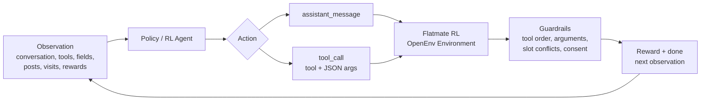
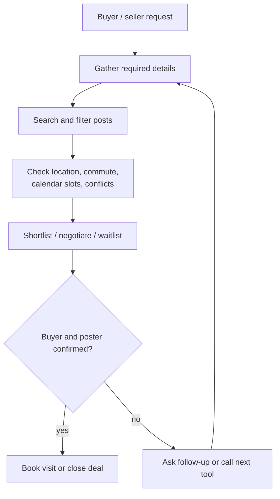
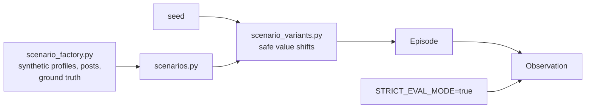
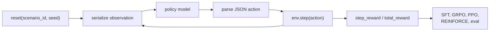
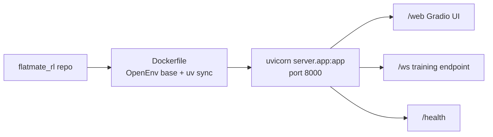
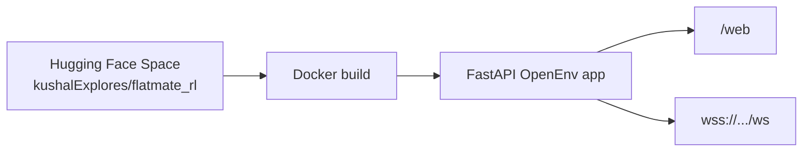

# Flatmate RL

Flatmate RL is a deterministic OpenEnv reinforcement-learning environment for broker agents. It models flatmate-share search as a multi-step workflow where the policy must gather details, inspect listings, check slots, coordinate buyer/seller confirmations, and schedule visits only when the guardrails are satisfied.

Read the full project writeup: [Flatmate RL: Training Broker Agents for Real Flatmate Search](flatmate_rl.md).

## Environment Flow





## At A Glance

| Area | Details |
| --- | --- |
| Runtime | OpenEnv environment served through FastAPI |
| Domain | flatmate-share search and visit scheduling |
| Policy output | `assistant_message` or structured `tool_call` |
| Observation | transcript, phase, tools, fields, posts, bookings, violations, reward |
| Reward signal | positive workflow progress, penalties for invalid order, hallucinated tools, bad bookings |
| UI | custom Gradio app at `/web` |
| Deployment | local Docker or Hugging Face Docker Space |

## Scenario Types

| Scenario | What the agent must learn |
| --- | --- |
| `task_visit_single` | book one valid visit |
| `task_visit_single_hidden_flex` | recover when the buyer reveals only one bad slot |
| `task_visit_multi` | schedule multiple non-overlapping visits |
| `task_visit_single_seller_followup` | switch from failed buyer flow to seller follow-up |
| `task_negotiation_hidden_budget` | discover buyer/seller price overlap |
| `task_slot_cancellation_waitlist` | waitlist, react to cancellation, then book |
| `task_multi_visit_preference_evolution` | update preferences after visits and new listings |
| `task_visit_conflict_check` | avoid pre-booked slots and propose only open times |

Scenario declarations live in [server/scenarios.py](server/scenarios.py) and are built with helpers from [server/scenario_factory.py](server/scenario_factory.py).

## Synthetic Data And No-Leakage Design



All scenarios are synthetic. Seeded variants use `random.Random(f"{task_id}:{seed}")` to vary safe surface values such as occupation, rent, budget, and opening messages while preserving task id, post ids, required tools, feasible slots, required bookings, phase transitions, and the canonical success path.

The environment should not contain real names, phone numbers, emails, addresses, scraped listings, or private housing records. If names or richer details are added later, generate them only inside [server/scenario_variants.py](server/scenario_variants.py) as synthetic seeded values.

For stricter evaluation, set:

```bash
STRICT_EVAL_MODE=true
```

Strict eval mode hides direct scenario labels, difficulty, gathered/remaining fields, violations, tool traces, and rewards from the observation while still allowing sanitized tool results. Use this when you want to reduce prompt leakage during model evaluation.

## Action, Observation, And Tools

`FlatmateRlAction` supports two action types:

- `assistant_message`
- `tool_call`

Example assistant action:

```python
from flatmate_rl import FlatmateRlAction

FlatmateRlAction(
    action_type="assistant_message",
    assistant_message="Please share your dietary preference and visit availability.",
)
```

Example tool action:

```python
from flatmate_rl import FlatmateRlAction

FlatmateRlAction(
    action_type="tool_call",
    tool_name="check_calendar_slots",
    tool_arguments={"post_ids": ["post_023", "post_031"]},
)
```

Each `reset` or `step` returns a `FlatmateRlObservation` with transcript state, active phase, available tools, gathered and remaining fields, selected posts, booked visits, violations, `step_reward`, and `total_reward`.

Main buyer tools include `store_user_details`, `search_posts`, `match_location_preference`, `get_commute_time`, `check_calendar_slots`, `shortlist`, `contact_poster`, and `book_viewing`. Scenario-specific tools add negotiation, waitlist, debrief, new-arrival filtering, and seller-follow-up workflows.

Guardrails penalize searching before storing user details, seller tools before seller details, booking before slot checks and confirmations, unknown tools, missing arguments, repeated successful calls, and non-canonical ordering.

## Quick Start

```python
from flatmate_rl import FlatmateRlAction
from flatmate_rl.server.flatmate_rl_environment import FlatmateRlEnvironment

env = FlatmateRlEnvironment()

obs = env.reset(scenario_id="task_visit_single")
print(obs.last_user_message)
print(obs.remaining_required_fields)

obs = env.step(
    FlatmateRlAction(
        action_type="assistant_message",
        assistant_message="Please share your dietary preference and visit availability.",
    )
)
print(obs.last_user_message)

obs = env.step(
    FlatmateRlAction(
        action_type="tool_call",
        tool_name="store_user_details",
        tool_arguments={},
    )
)
print(obs.last_tool_result)
```

## Training An RL Agent

Use the environment as a reward source for an LLM or seq2seq policy that emits JSON actions.



Recommended path: start with SFT/imitation on valid trajectories, then use GRPO/PPO/REINFORCE with endpoint reward. Evaluate on held-out seeds with `STRICT_EVAL_MODE=true`.

Minimal local loop:

```python
import random

from flatmate_rl import FlatmateRlAction
from flatmate_rl.server.flatmate_rl_environment import FlatmateRlEnvironment


SCENARIOS = [
    "task_visit_single",
    "task_visit_single_hidden_flex",
    "task_visit_multi",
    "task_visit_single_seller_followup",
]

env = FlatmateRlEnvironment()

for episode_idx in range(100):
    obs = env.reset(scenario_id=random.choice(SCENARIOS), seed=episode_idx)

    while not obs.done:
        prompt = obs.model_dump()
        action_json = policy_generate_json(prompt)  # your model
        action = FlatmateRlAction.model_validate(action_json)
        obs = env.step(action)
        update_policy(obs.step_reward, obs.total_reward, obs.done)
```

When training against Docker or the Hugging Face Space, use `/ws`; a websocket session keeps one environment instance alive across `reset` and `step`.

```python
import asyncio
import json

import websockets


async def rollout(ws_url: str) -> None:
    async with websockets.connect(ws_url, open_timeout=120, ping_timeout=120) as ws:
        await ws.send(json.dumps({"type": "reset", "data": {"scenario_id": "task_visit_single", "seed": 7}}))
        reset_payload = json.loads(await ws.recv())

        action = {
            "action_type": "assistant_message",
            "assistant_message": "Please share your dietary preference and visit availability.",
        }
        await ws.send(json.dumps({"type": "step", "data": action}))
        step_payload = json.loads(await ws.recv())

        print(reset_payload["observation"]["status"])
        print(step_payload["reward"], step_payload["done"])
        await ws.send(json.dumps({"type": "close"}))


asyncio.run(rollout("ws://127.0.0.1:8000/ws"))
# Hosted Space: wss://kushalexplores-flatmate-rl.hf.space/ws
```

## Running With Docker



Build and run locally:

```bash
cd flatmate_rl
docker build -t flatmate_rl .
docker run --rm -p 8000:8000 flatmate_rl
```

Open the UI:

```text
http://127.0.0.1:8000/web
```

Use the websocket endpoint for training:

```text
ws://127.0.0.1:8000/ws
```

The Dockerfile uses the OpenEnv base image, installs dependencies with `uv`, sets `ENABLE_WEB_INTERFACE=true`, exposes the app on port `8000`, and starts:

```bash
uvicorn server.app:app --host 0.0.0.0 --port 8000
```

## Hugging Face Space Deployment



The deployed Space is:

```text
https://huggingface.co/spaces/kushalExplores/flatmate_rl
```

The Space is configured as Docker/FastAPI:

```yaml
sdk: docker
app_port: 8000
base_path: /web
```

The OpenEnv deployment config is in [openenv.yaml](openenv.yaml):

```yaml
spec_version: 1
name: flatmate_rl
type: space
runtime: fastapi
app: server.app:app
port: 8000
```

Programmatic training endpoint:

```text
wss://kushalexplores-flatmate-rl.hf.space/ws
```

For the browser UI, open:

```text
https://kushalexplores-flatmate-rl.hf.space/web
```

If Hugging Face changes the direct app subdomain, open the Space page and use the app link shown there.

The server is configured with `max_concurrent_envs=4`, so keep GRPO/PPO reward workers conservative at first. Increase rollout concurrency only after the endpoint is stable.

## Web UI

The environment exposes a custom Gradio UI at `/web`.

It includes:

- scenario selector
- transcript viewer
- assistant-message controls
- tool-call runner with JSON arguments
- live gathered/remaining field panels
- selected posts, booked visits, violations
- request/response payload panes

Run locally:

```bash
cd flatmate_rl
uv run --project . server
```

Then open:

```text
http://127.0.0.1:8000/web
```

## Local Development

```bash
cd flatmate_rl
python3.12 -m venv .venv
source .venv/bin/activate
pip install -e .[dev]
pytest
```

Or with `uv`:

```bash
cd flatmate_rl
uv sync
uv run --project . pytest
uv run --project . server
```

## Tests

The test suite checks:

- scenario parity against `broker_app`
- ordering guardrails
- single-visit booking flow
- hidden-flex slot behavior
- multi-booking flow
- seller-follow-up scheduling

Run:

```bash
flatmate_rl/.venv/bin/python -m pytest flatmate_rl/tests/test_flatmate_rl.py
```

## Repository Layout

```text
flatmate_rl/
├── Dockerfile
├── README.md
├── client.py
├── models.py
├── openenv.yaml
├── pyproject.toml
├── server/
│   ├── app.py
│   ├── episode.py
│   ├── flatmate_rl_environment.py
│   ├── gradio_ui.py
│   ├── scenario_factory.py
│   ├── scenario_variants.py
│   └── scenarios.py
└── tests/
    └── test_flatmate_rl.py
```

## Notes

- The environment is deterministic and designed for RL experimentation, not as a drop-in replacement for the original multi-LLM broker simulator.
- The current Python 3.13 Anaconda runtime in this workspace can crash when importing parts of `openenv`; using the local Python 3.12 virtualenv is the safer path for testing here.
